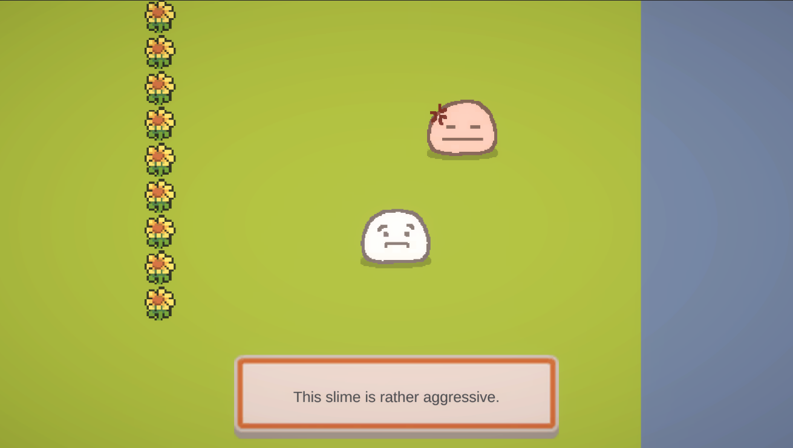
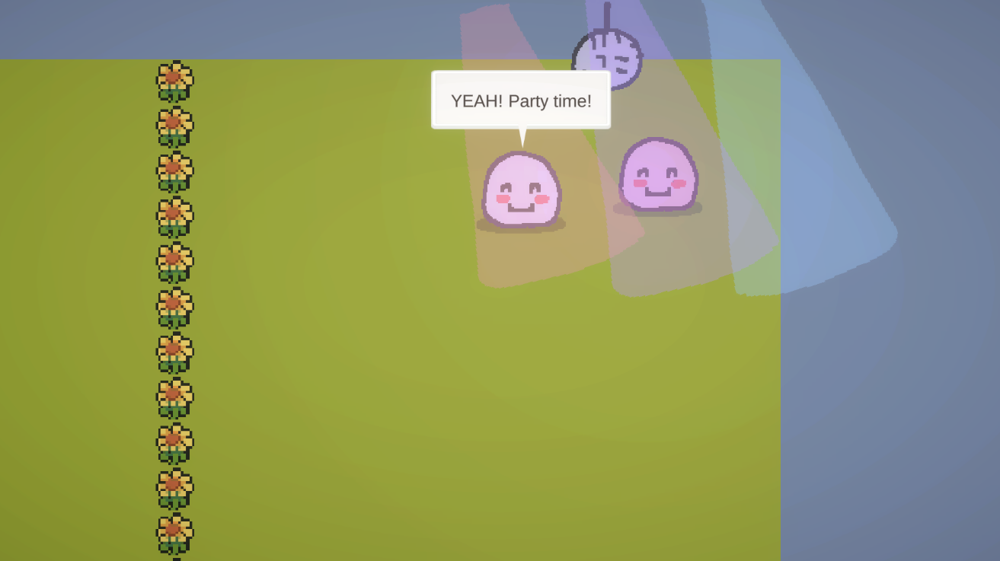

# Unity Kataru Demo

## About
Pretty big Unity starter project with Kataru submodule. Tested on 2020.3.31f1 (LTS). 

Topdown 2D but I imagine it's pretty easy to convert it to another style.

Kataru yml files located in Assets/Kataru/Editor.

For syntax highlighting, download the [Kataru Extension](https://marketplace.visualstudio.com/items?itemName=Kataru.vscode-kataru).

Contains:
- A ton of Kataru commands
- Saving and loading via Kataru
- Scene loading framework
- Dialogue UI framework
- Basic AudioMixer setup
- Basic player movement
- Basic tutorial system
- Settings/rebinding controls
- Closeups framework
- Camera stacking

As well as the following third party packages:
- Input System
- URP 2D Renderer
- Post Processing
- Cinemachine
- TextMeshPro
- NaughtyAttributes
- Hierarchy2
- Rotary Heart Serialized Dictionary Lite
- SuperUnityBuild
- DOTween

Cool misc features:
- Wiggly dialogue text
- Bubble stays on screen when character goes off screen
- Voice blips
- Customizable bubble depending on character

You can test out Windows, Mac and Linux builds [here](https://zephyo1.itch.io/unity-kataru-demo). Note that Kataru is not ready for WebGL yet.   

## Installation
1. Clone repo
2. Init Kataru submodule

TODO: Remove submodule and add Kataru as a git reference in manifest instead.

## How to Play

Open "Core" scene then open "StartMenu" as additive scene.

## Implementation notes

Note that the Kataru.Constants class is used in collaboration with NaughtyAttributes to provide UI for selecting namespaces, characters, or passages, and is not necessary; if you choose to keep it then be sure to add to the classes in that file as you write your story.

Sometimes in a CommandHandler, a character is referred to as a 'reference.' This indicates that the character is mainly a character to deliver commands, not dialogue lines.

For more info on working with Unity and Kataru, see [the docs](http://kataru-lang.github.io/).
